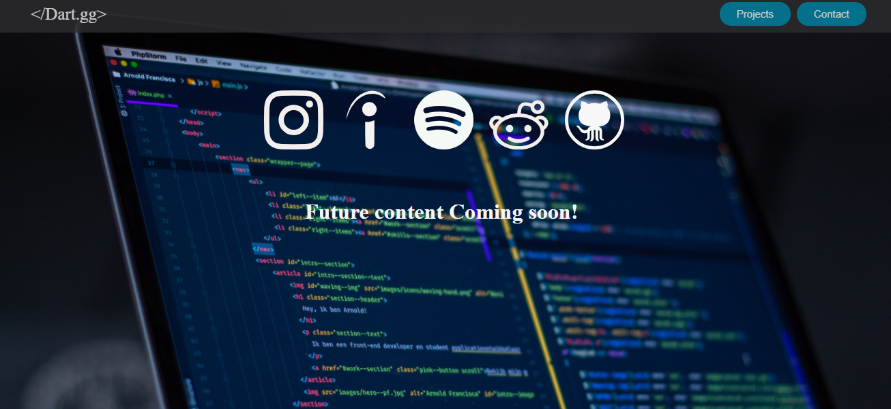

# Personal Portfolio ⚡️ 
> A clean, beautiful, responsive portfolio template for Software Developers!

> https://dartsams.github.io/main_index.html

### Website Preview

 
    

## Features 
> Iphone 11 Responsive\
> Valid HTML5 & CSS3\
> Easy to modify

## Installation & Deployment 
>	Clone the repository using (git clone https://github.com/DartSams/DartSams.github.io.git)
>	Modify the index.html and projects.html file to suite your profile 
>	Create a new repository called ‘<your-github-username>.github.io’ this allows github to host your new static website.
>	Copy over all the html,css,and assets to the new repository 
>	Push to the ‘master’ branch of the repository

## Sections 📚
✔️ Home & socials
✔️ Projects
✔️ Contact Info

## Tools Used 🛠️
* [<b>GitHub Pages</b>](https://create-react-app.dev/docs/deployment/#github-pages) - To host my static website (HTML & CSS).

